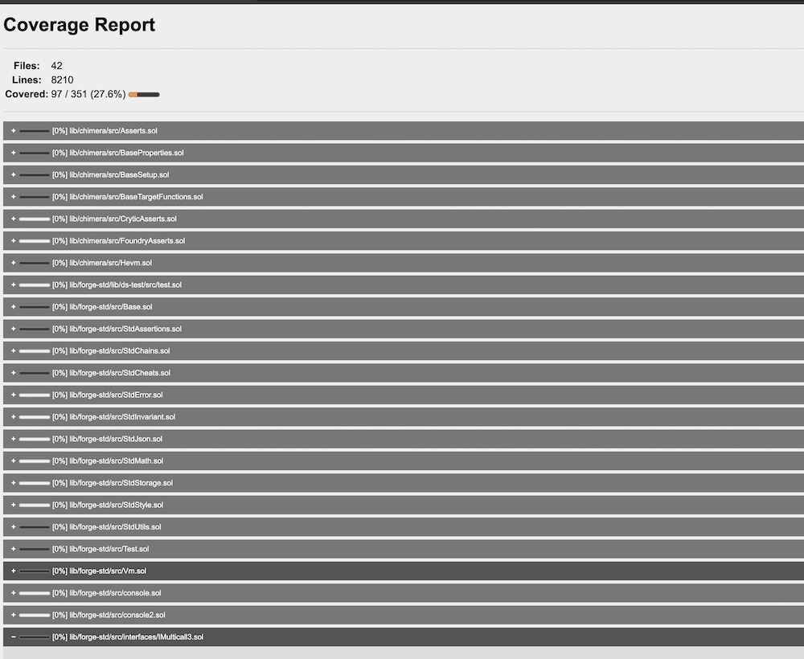
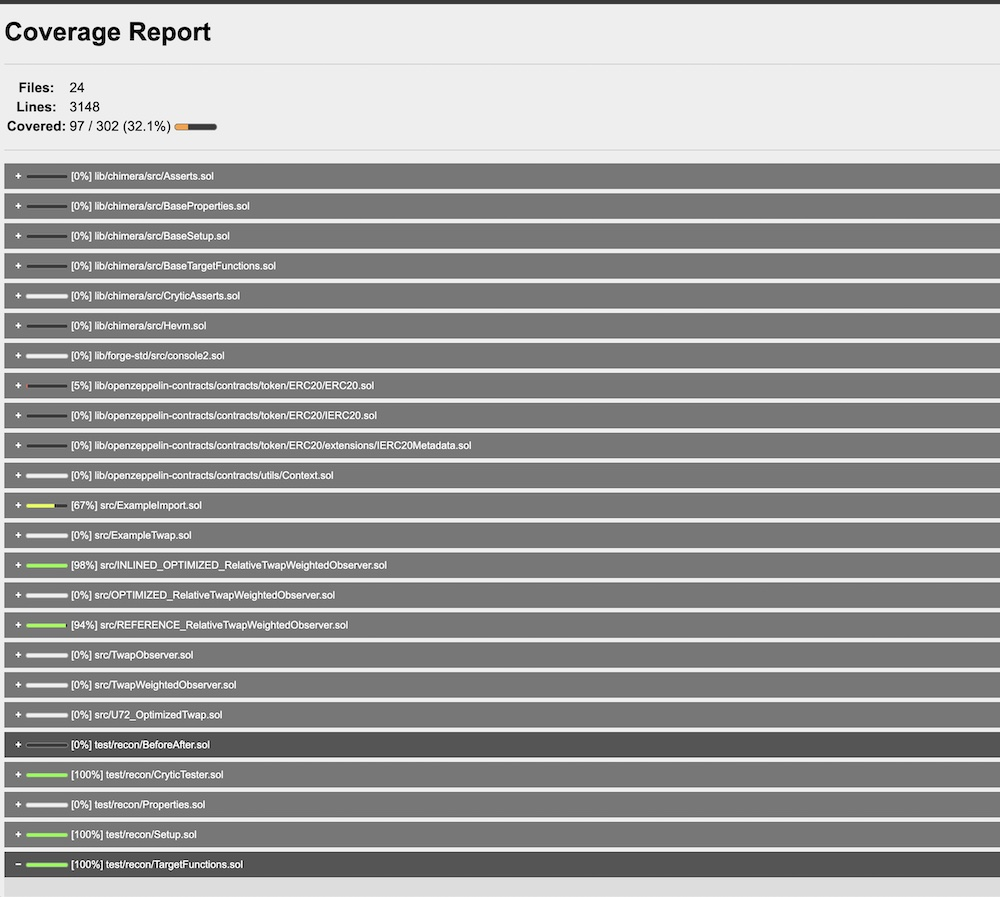

# POC for medusa compilation settings

## with `--foundry-compile-all` flag
### `medusa fuzz --config medusa-all.json`

## without `--foundry-compile-all` flag (pointing to CryticTester)
### `medusa fuzz --config medusa.json` or (`medusa fuzz`)

** Note: medusa.json should be in the same directory as the foundry.toml file **

# NOT AUDITED - YOU WILL REK YOURSELF

- Release Candidate: OPTIMIZED_RelativeTwapWeightedObserver
- Reference Implementation: REFERENCE_RelativeTwapWeightedObserver

## Requirements

Release Candidate must meet reference functionality given the following constraints:
- 80 years of operations
- `valueToTrack` having a maximum value of 100e27 (100 Billion eBTC)

## Goals

- For Spike up, we want to delay those spike ups
- For spike downs, we will use min(TWAP, Spot) meaning that we always chose the lowest value